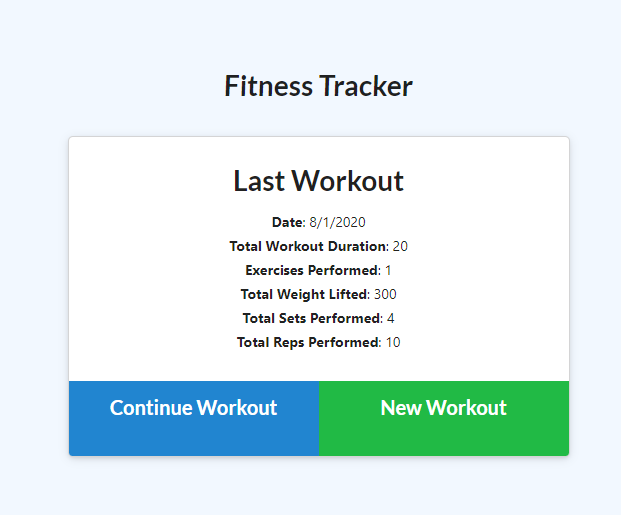
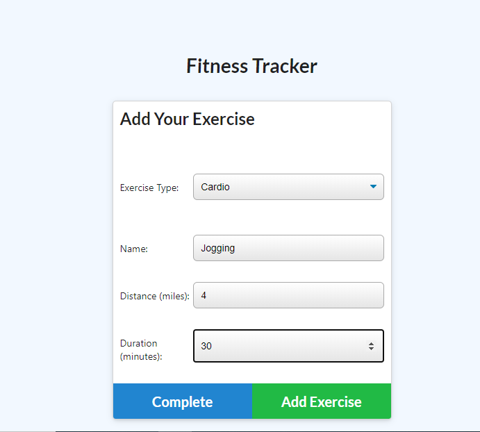
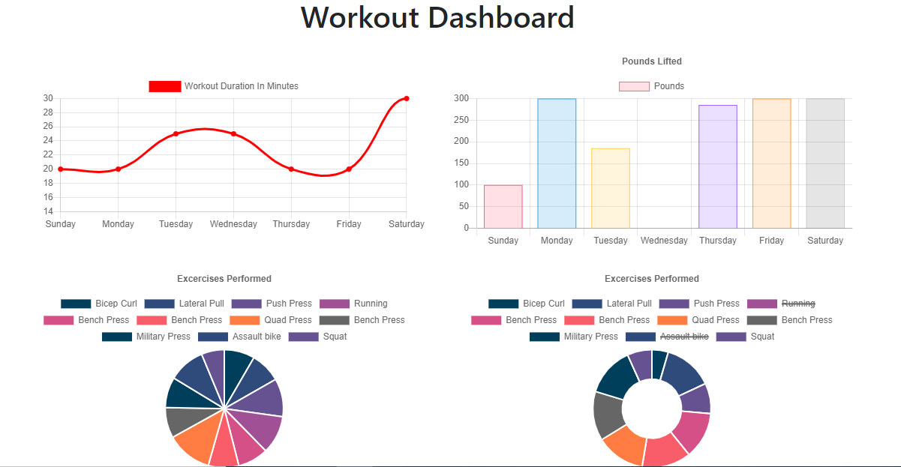

# Workout Tracker

Tracking your exercises is an excellent way to monitor your progess. This Workout Tracker allows you to track both your cardio and resistance training exercises. Save workout names, number of reps and sets, and the time you spend on that exercise. After you enter your exercise you can view your progess on the workout dashboard!

## How the application works

This application uses Mongoose DB and Express.js. Mongoose is used to to save exercise data, build the schema, and seed data. The routing was done using Express to render the HTML pages and to send user data to store and view in the database.

## How it looks

- Heroku: https://polar-sands-58344.herokuapp.com/?id=5f289cdff126d600179713dd
- GitHub Repo: https://github.com/tlam1288/Workout-Tracker

